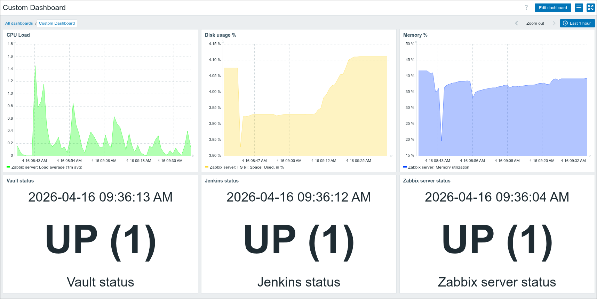

📌 DevOps Environment with Monitoring

This project sets up a local DevOps environment using Vagrant with integrated services and monitoring.

The environment includes:
- Jenkins (CI/CD)
- Vault (secrets management)
- Zabbix (monitoring)
- Apache (reverse proxy)
- MariaDB (database)

⸻

⚙️ Setup

Start the environment:

vagrant up

To re-run provisioning:

vagrant provision

⸻

🌐 Access

Services are available via local domains:
- Jenkins → http://jenkins.local
- Zabbix → http://zabbix.local
- Vault → http://vault.local:8200

⸻

🧭 Hosts Configuration

Add this to your host machine (/etc/hosts):

- 192.168.60.10 zabbix.local
- 192.168.60.10 jenkins.local
- 192.168.60.10 vault.local

⸻

🧱 Architecture
- Jenkins runs in Docker (port 8080)
- Vault runs in development mode (port 8200)
- Zabbix server + frontend installed on VM
- MariaDB used as Zabbix database
- Apache used as reverse proxy

Routing:
- jenkins.local → proxy to 127.0.0.1:8080
- zabbix.local → Zabbix frontend
- Vault → direct access (no proxy)

Without proxy:
- Jenkins → http://jenkins.local:8080

⸻

🔐 Vault Usage (Web UI)

Open:

http://vault.local:8200

Vault runs in development mode, so it is already initialized and unsealed.

⸻

Login
- Select authentication method: Token
- Enter:

root

- Click Sign In

⸻

Create a secret
- Go to Secrets → KV → Create secret
- Path: myapp
- Add key/value:
- username: admin
- password: 1234
- Click Save

⸻

⚙️ Jenkins Usage (Web UI)

Open:

http://jenkins.local

⸻

1. Unlock Jenkins

Get password from VM:

docker exec jenkins cat /var/jenkins_home/secrets/initialAdminPassword

Or use password shown during provisioning.

⸻

2. Initial setup
- Install suggested plugins (recommended)
- Create admin user

⸻

3. Create job
- Click New Item
- Name: test-job
- Type: Freestyle project

⸻

4. Build step

Add:

echo "Hello from Jenkins"

⸻

5. Run job
- Click Build Now
- Open Console Output

Expected result:

Hello from Jenkins

⸻

📊 Zabbix Usage

Open:

http://zabbix.local

⸻

Initial setup
- DB type → MySQL
- DB name → zabbix
- User → zabbix
- Password → password

⸻

Login
- Username: Admin
- Password: zabbix

⸻

Monitoring

Zabbix monitors:
- CPU usage
- Memory usage
- Disk usage
- Jenkins status
- Vault status

Custom template is used for service monitoring.

⸻

📸 Dashboard

⸻

Widgets explanation
- CPU → system load
- Memory → RAM usage
- Disk → storage usage
- Jenkins → HTTP check (200 = UP)
- Vault → service status
- Triggers → active alerts

⸻

🗄 Database Configuration
- Database: zabbix
- User: zabbix
- Password: password

Configured in:

/etc/zabbix/zabbix_server.conf

⸻

🚀 Provisioning

Provisioning is automated using:
- base.sh
- vault.sh
- jenkins.sh
- zabbix.sh
- apache.sh

Features:
- Automatic setup
- Database initialization
- Configuration generation
- Idempotent provisioning

🧠 Summary

This project demonstrates:
- CI/CD → Jenkins
- Secrets management → Vault
- Monitoring → Zabbix
- Reverse proxy setup
- Infrastructure automation
 
